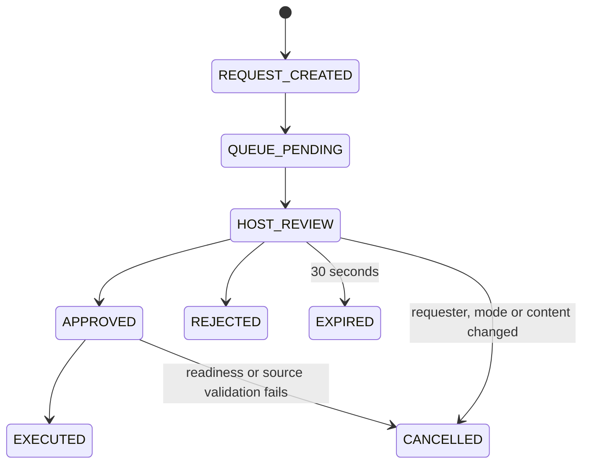
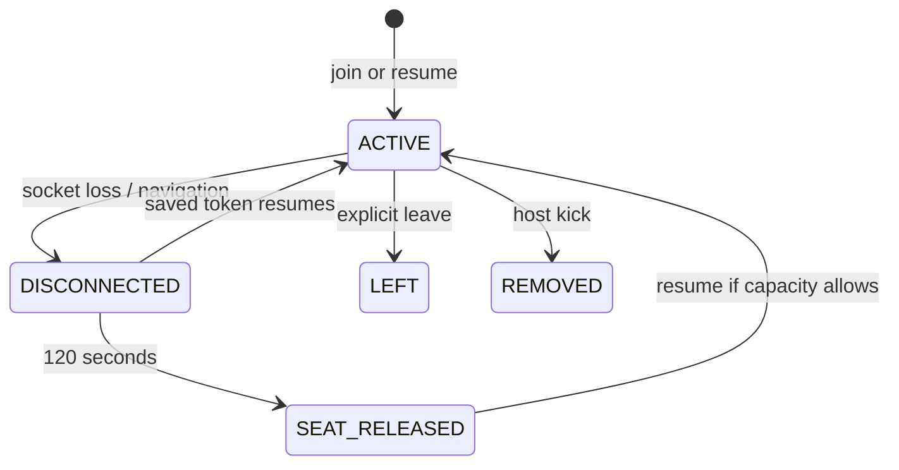
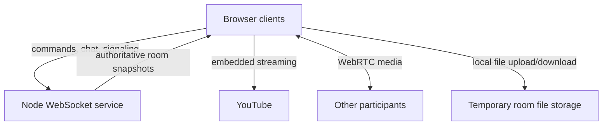
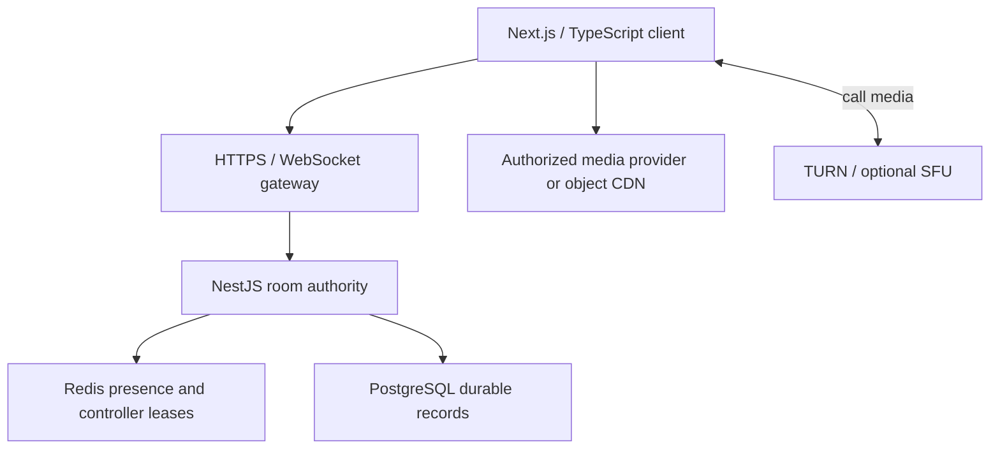

# Xparty 0.6 — control and recovery

This document separates the implemented release from the master prompt's proposed production architecture. The live application remains the existing Node/WebSocket service and browser ES modules. It has not been rewritten in Next.js/NestJS or scaled to thousands of simultaneous users.

## Implemented authority

| Mode | Guest playback | Content / large seek | Host |
|---|---|---|---|
| Host Approval (default) | Approval request | Approval request | Immediate control |
| Host Only | Denied, no playback request | Denied | Immediate control |
| Shared Control | One controller, renewable 10-second lease | Host approval for source changes and seeks over 60 seconds | Immediate override |

The host switches modes from the key menu at any time. Mode or content changes cancel stale pending requests. Guests retain chat and local volume. Queue entries are FIFO; voting is removed. Host-only guest behavior follows the master prompt where it differs from Party control.txt. No intro-skipping UI is invented without timestamp metadata.

Requests expire after 30 seconds. Hosts choose manual review, auto approve or auto reject, with selective auto approval for resync and pause. The UI prioritizes sync, playback, content, then mode requests. This is a review ordering, not a promise that a lower-priority request cannot be selected manually. Automatic decisions execute immediately. Source/revision checks prevent stale seeks. Duplicate event IDs and duplicate pending actions are ignored; requests and playback events are rate limited. These safeguards are process-local, not distributed exactly-once guarantees.

The created/queued/review transitions occur synchronously; snapshots normally expose HOST_REVIEW rather than those short-lived intermediate states. Approved actions use the same playback dispatch path as host actions. Approval is not execution: rejected, cancelled and expired actions do not mutate the timeline.

## Membership and recovery

A random bearer session token is stored as essential browser storage, separately from optional appearance preferences. Never put it in URLs or logs. A returned token reuses the participant identity and can replace the old socket; it does not consume a new seat. Explicit leave and kick differ from navigation loss.

Disconnected seats count toward capacity for 120 seconds. A disconnected host retains authority during that window; afterwards the oldest connected participant becomes temporary host. The owner regains authority on resume. Explicit owner exit hands off immediately. Ending the room invalidates all credentials. Reopening offers Return or Leave; re-entering the same code also reuses the saved identity. Returning after a server restart is not guaranteed with current ephemeral storage.

## Synchronization boundary

The existing correction algorithm, clock-offset sampling, buffering hold/recovery and native-player feedback suppression are retained. New permission gates decide whether a command can reach that existing timeline. App controls are the only source of user playback commands; native YouTube state callbacks do not echo pause/play back to the room. Focus call changes CSS layout around the same movie player rather than recreating it.

The floating movie is in-app picture-in-picture, not an OS-level PiP window. Drag the handle below call tiles, or focus it and use arrow keys, to resize the call area. Device widths constrain the result. Call-only view can still switch to chat without ending the media connection.

## Current data flow

YouTube media does not traverse the room server. Current local-file support DOES upload temporary files to the room service and download them to guests; that is an explicit exception to the master prompt's target of a control-only backend. Retain this working path until a tested P2P/object-storage replacement exists. Provider-controlled media chunks are not prefetched by this application. Buffering and browser autoplay restrictions cannot be eliminated by room synchronization.

## Proposed production architecture — not provisioned

Keep the current playback contract and migrate behind compatibility tests. A room must have one logical writer. Redis lease acquisition/renewal and command revision changes require atomic scripts/transactions. Pub/sub alone is not durable command delivery; use a durable event stream/outbox and client event IDs, reconcile on reconnect, reject old revisions. Multiple instances need shared sessions and authorization, not just sticky sockets.

### Proposed record model

- rooms: UUID, unique short code, owner, current host, mode, capacity, locked, lifecycle, created_at, ended_at.
- participants: UUID, room UUID, optional account UUID, display name, hashed resume credential, joined_at, disconnected_at, reserved_until, explicit_left_at, revoked_at.
- playback: room UUID, source JSON, revision, position_seconds, playing, updated_at, previous_source JSON.
- requests: UUID, room UUID, participant UUID, action JSON, source UUID, expected_revision, status, created_at, expires_at, reviewed_by, decided_at, reason, unique client_event_id within participant.
- queue_items: UUID, room UUID, provider, content_id, title, ordering, added_by.
- room_events/outbox: sequence, room UUID, event ID, event type, payload, timestamp; retention policy required.
- messages: UUID, room UUID, sender UUID, optional recipient UUID, body, timestamp, deletion timestamp. Enforce recipient authorization on reads as on delivery.
- accounts/profile/friends: optional separate authenticated subsystem; account deletion must revoke credentials and apply data retention rules. Existing optional Supabase scaffolding is not enabled by this release.

Redis holds presence TTLs, heartbeat timestamps, short controller leases, rate buckets and routing. PostgreSQL holds durable room metadata and approved event history. Store only hashed resume credentials in the production database. Controller lease expiry and host handoff must be tested against partitions and competing workers.

### Release roadmap and gates

1. Ship and monitor 0.6 single-instance permission/rejoin/call UI changes; physical phone + desktop validation across separate networks is still required.
2. Configure durable room storage and migration/restore tests before claiming restart-safe rooms. Configure TURN with a cost limit and test restrictive networks.
3. Configure optional OTP/OAuth providers, consent/deletion, quotas and abuse controls before enabling accounts. SMS delivery has external cost and provider setup requirements.
4. Move local files to an authorized expiring object-storage or WebRTC path; test interrupted transfers, access revocation and cleanup. Add other providers only through supported embeds/auth; do not promise Netflix/Prime DRM playback parity.
5. Introduce typed shared protocol and migrate UI/server incrementally. Add distributed room authority, outbox, backpressure, deployment drain and reconnect tests before horizontal scaling.
6. Benchmark realistic clients and network loss: command-to-render latency, drift percentiles, reconnect time, duplicate events, queue expiry, memory and egress. No 1,000-user readiness claim until that workload is measured. Kubernetes is a later operational option, not an installed requirement.

Privacy choices are an in-app essential/optional storage control; no analytics service is installed. This implementation is not a legal compliance certification. Operational retention, provider agreements and jurisdiction-specific notices remain the operator's responsibility.

## 0.7 policy update (supersedes the host-mode playback rows above)

The latest owner instruction changes guest playback in HOST_APPROVAL and HOST_ONLY: Pause is device-local; Play resumes at the authoritative host position. Stop and seeks are host-only in these modes. Shared mode retains its ten-second controller lease, but an explicit Stop command is always host-only. Content/mode requests still use the approval engine. Guest local pause sends no shared playback command. Buffer recovery retains correction thresholds, but ordinary playback-status messages no longer force correction absent a new revision or explicit resync.
